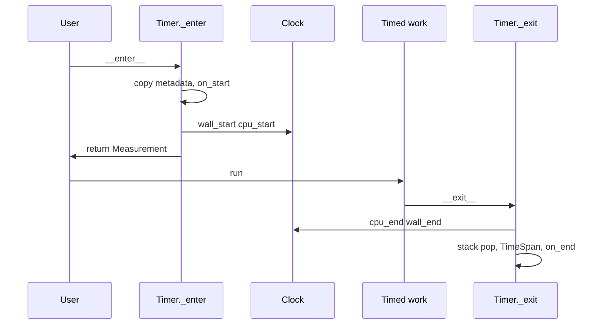

# Timer overview

**Timer** is the main entry point. It measures execution and records wall-clock and CPU time per run. It operates in two modes: as a **context manager** (wraps a block of code in a `with` statement to time it automatically) or as a **decorator** (wraps a function with `@Timer()` to time every call). Both modes support synchronous and asynchronous use; the decorator also supports sync and async generators.

## How timing works

`Timer` samples clocks when entering and exiting the timed region (Python's `__enter__` / `__exit__` hooks, called automatically by the `with` statement). The [Measurement](measurement.md) fields `wall_time` and `cpu_time` are built from those samples as [`TimeSpan`](timespan.md) values.

`wall_time` and `cpu_time` are the intervals between clock samples taken when entering the timed region and when exiting it. Creating the `Measurement`, copying metadata, and running `on_start` (if any) all happen before the first sample, so they are outside the span. The span ends at the start of `__exit__`, before the stack is popped and `TimeSpan` values are assigned; `on_end` runs after that. A small amount of context-manager and interpreter work right after the first sample and right before the last sample is included in what you see.

!!! note "Sampling order"

    On exit, CPU time is sampled before wall time, so `wall_time` can be slightly larger than `cpu_time` even with little I/O or scheduling.

`wall_time` uses `time.perf_counter_ns()` (monotonic elapsed wall time — counts all real time including waiting). `cpu_time` uses `time.process_time_ns()` (total CPU time of the current process — only counts time the processor spent running your code, not time spent waiting on I/O or sleep). Nested use of the same `Timer` instance stacks measurements: each level has its own `Measurement`, and inner wall time falls inside outer wall time when nested.

## Constructor parameters

All parameters are optional and keyword-only (passed by name, e.g. `Timer(metadata={...})`, not by position).

| Parameter   | Type | Description |
|------------|------|-------------|
| `metadata` | `dict \| None` | Key-value metadata for the measurement(s). Each measurement gets a deep copy when the timed block or call begins. Defaults to `{}`. |
| `on_start` | `callable \| None` | Called once per measurement when timing is about to start. Receives the `Measurement` (metadata set; `wall_time` and `cpu_time` are `None`). Defaults to `None`. |
| `on_end`   | `callable \| None` | Called once per measurement when timing has just ended. Receives the `Measurement` with `wall_time` and `cpu_time` set. Defaults to `None`. |
| `maxlen`   | `int \| None` | **Decorator only.** Maximum number of measurements to keep on the wrapped callable. Ignored when used as a context manager. Defaults to `None` (unbounded). |

## Context manager mode

Use `with Timer() as m:` (sync) or `async with Timer() as m:` (async). On block exit, the returned `Measurement` has its `wall_time` and `cpu_time` set. There is one measurement per block; nested and sequential blocks each receive their own measurement. See [Measure a block](measure-block.md) for nested blocks, multiple threads, and exception behavior.

## Decorator mode

Apply `@Timer()` (or `@Timer(metadata={...}, maxlen=100)` etc.) to a function or generator. Each call produces one `Measurement`, appended to the wrapped callable’s `measurements` deque. Supported callables include sync and async functions and sync and async generators (one measurement per call, or per full consumption for generators). See [Measure function calls](measure-functions.md) for `maxlen` and thread safety.

## Callbacks

`on_start` and `on_end` are synchronous-only callbacks. See [Callbacks](callbacks.md) for invocation timing, what they receive, and async integration.
